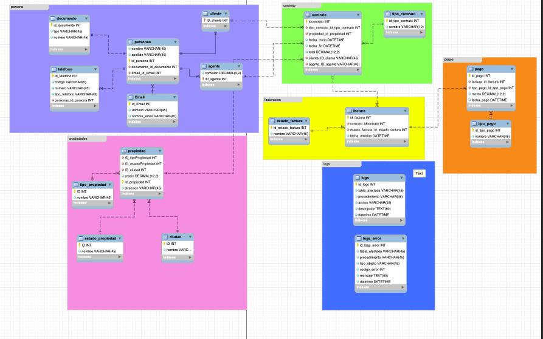
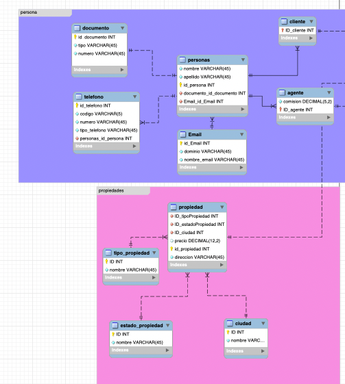
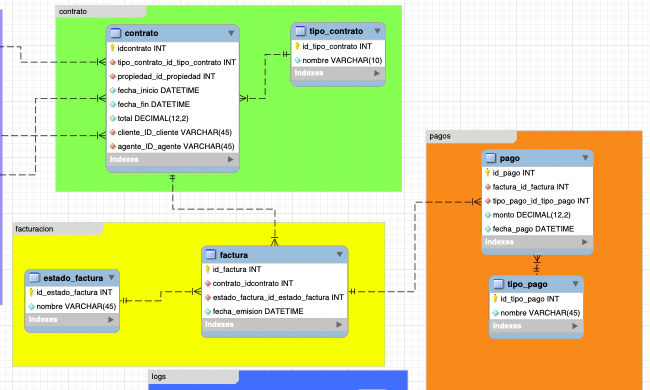
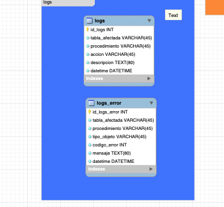

# 📋 Sistema de Gestión Inmobiliaria - MySQL

## 📌 Descripción General

Este proyecto implementa una **base de datos robusta y segura** para gestionar el portafolio de propiedades (casas, apartamentos, locales comerciales), clientes interesados en alquilar o comprar, contratos firmados e historial de pagos de una inmobiliaria.

El sistema está diseñado como un **prototipo profesional** para ser utilizado en ambientes reales, con énfasis en:

- ✅ Normalización correcta hasta 3FN
- ✅ Integridad referencial y consistencia de datos
- ✅ Auditoría y registro histórico de cambios
- ✅ Seguridad con roles diferenciados
- ✅ Optimización de consultas con índices estratégicos
- ✅ Automatización mediante eventos programados

---

## 🎯 Objetivos del Proyecto

1. **Administración de propiedades**: Registrar casas, apartamentos y locales con sus características
2. **Gestión de clientes**: Mantener base de datos de personas interesadas en arrendar o comprar
3. **Control de contratos**: Documentar acuerdos de venta y arriendo con fechas y valores
4. **Facturación y pagos**: Registrar pagos realizados y deuda pendiente
5. **Auditoría completa**: Registrar todos los cambios en el sistema de forma automática
6. **Control de acceso**: Tres roles diferenciados (administrador, agente, contador) con permisos específicos

---

## 📊 Modelo Entidad-Relación (MER)

### Diagrama General del MER

El diseño se divide en **5 áreas funcionales principales**, cada una representada con colores específicos:

#### **Área 1: Gestión de Personas (Púrpura)**
Gestiona la información global de personas, clientes y agentes con sus datos de contacto normalizados.

#### **Área 2: Gestión de Propiedades (Rosa)**
Administra el inventario de propiedades, sus tipos, estados y ubicaciones geográficas.

#### **Área 3: Gestión de Contratos (Verde)**
Vincula clientes, agentes y propiedades mediante contratos de venta y arriendo.

#### **Área 4: Gestión Financiera (Naranja)**
Controla facturas, pagos y métodos de pago.

#### **Área 5: Auditoría y Logs (Azul)**
Registra automáticamente todos los cambios del sistema con detalles de error.

### Relaciones Principales

```
personas (global)
    ├─→ cliente (herencia)
    ├─→ agente (herencia)
    ├─→ documento (1:1)
    ├─→ email (1:N)
    └─→ telefono (1:N)

propiedad
    ├─→ tipo_propiedad (N:1)
    ├─→ estado_propiedad (N:1)
    └─→ ciudad (N:1)

contrato (tabla maestra)
    ├─→ cliente (N:1)
    ├─→ agente (N:1)
    ├─→ propiedad (N:1)
    └─→ tipo_contrato (N:1)

factura
    ├─→ contrato (N:1)
    └─→ estado_factura (N:1)

pago
    ├─→ factura (N:1)
    └─→ tipo_pago (N:1)

logs / logs_error
    └─→ (Registran cambios en todo el sistema)
```









---

## 🔧 Diseño y Normalización de la Base de Datos

### Justificación de Estructura a 3FN

#### **Grupo 1: Catálogos de Personas**

**¿Por qué separar documento, email y teléfono?**

- **Tabla `documento`**: Un cliente o agente puede tener documento de ciudadanía, de extranjería o pasaporte. Al normalizarlo, validamos el tipo de documento y evitamos duplicación de datos de identificación.

- **Tabla `email`**: Una persona puede tener múltiples emails de diferentes dominios (Gmail, Outlook, Yahoo, etc.). La normalización permite manejar varios emails por persona sin redundancia.

- **Tabla `telefono`**: Los teléfonos tienen códigos de país distintos (+57 para Colombia, +1 para USA, etc.). La normalización permite registrar teléfonos móviles, fijos y de diferentes países sin confusión.

- **Tabla `personas`**: Creada como tabla GLOBAL porque **un agente puede ser cliente y viceversa**. En lugar de duplicar datos, extendemos mediante herencia (`cliente` y `agente`).

#### **Grupo 2: Roles y Especialización**

- **Tabla `cliente`**: Hereda de personas. Representa a personas que compran o alquilan propiedades.
- **Tabla `agente`**: Hereda de personas. Incluye campo `comision` en porcentaje para calcular automáticamente ganancias por venta/arriendo.

#### **Grupo 3: Catálogos de Propiedades**

- **Tabla `tipo_propiedad`**: Normalizado (casa, apartamento, local comercial). Permite filtros y reportes por tipo.

- **Tabla `estado_propiedad`**: Normalizado (disponible, arrendada, vendida). Es crítico para registrar cambios automáticos mediante triggers.

- **Tabla `ciudad`**: Permite ubicar propiedades y evita conflictos cuando dos direcciones son idénticas en ciudades diferentes. También facilita búsquedas geográficas.

- **Tabla `propiedad`**: Tabla maestra de propiedades que referencia a tipo, estado y ciudad.

#### **Grupo 4: Contratos - Tabla Maestra**

- **Tabla `tipo_contrato`**: Normalizado (venta, arriendo). Diferentes tipos requieren tratamientos distintos en facturación.

- **Tabla `contrato`**: 
  - Une cliente, agente y propiedad
  - `fecha_inicio` y `fecha_fin` son críticas para contratos de arriendo (calculan duración, frecuencia de pagos)
  - `total` es el valor total a pagar según el contrato
  - Permite rastrear histórico completo de transacciones

#### **Grupo 5: Facturación y Pagos**

- **Tabla `estado_factura`**: Normalizado (pagada, pendiente). Una factura puede tener estado diferente al contrato total.

- **Tabla `factura`**: 
  - Relaciona contrato con estado de pago
  - `fecha_emision` puede diferir de `fecha_inicio` del contrato
  - Permite múltiples facturas por contrato (pagos mensuales, parciales, etc.)

- **Tabla `tipo_pago`**: Normalizado (efectivo, transferencia, tarjeta, consignación). Facilita reportes financieros por método de pago.

- **Tabla `pago`**: 
  - Registra cada transacción de pago
  - `monto` puede ser menor al total (pago parcial)
  - `fecha_pago` permite auditoría temporal de flujo de caja

#### **Grupo 6: Auditoría y Logs**

- **Tabla `logs`**: 
  - `tabla_afectada`: Indica dónde ocurrió el cambio
  - `procedimiento`: Qué función/trigger ejecutó la acción
  - `accion`: Tipo de operación (INSERT, UPDATE, DELETE, CAMBIO_DE_ESTADO)
  - `descripcion`: Detalles específicos del cambio
  - `fecha_registro`: Cuándo ocurrió
  - **Particionado por AÑO**: Mejora rendimiento con grandes volúmenes históricos

- **Tabla `logs_error`**: 
  - Registro automático de errores de base de datos
  - `codigo_error` y `mensaje`: Facilitan debugging
  - **Particionado por AÑO**: Igual que logs para consistencia

---

## 🧠 Funcionalidades SQL Implementadas

### 1. **Funciones Personalizadas (UDFs)**

#### `fn_calcular_comision(p_id_contrato INT)`
```sql
-- Calcula la comisión del agente en porcentaje
-- Ejemplo: Contrato de $500M con comisión 5% = $25M

SELECT fn_calcular_comision(1) AS comision_agente;
```

#### `fn_calcular_deuda(p_id_contrato INT)`
```sql
-- Calcula deuda pendiente = total_contrato - sum(pagos_realizados)
-- Esencial para contratos de arriendo

SELECT fn_calcular_deuda(2) AS deuda_pendiente;
```

#### `fn_count_propiedades_disponibles(p_id_tipo INT)`
```sql
-- Cuenta propiedades disponibles por tipo (casa, apartamento, local)
-- Parámetro 1 = casas, 2 = apartamentos, 3 = locales

SELECT fn_count_propiedades_disponibles(1) AS casas_disponibles;
```

### 2. **Triggers de Auditoría**

#### `trg_insert_propiedad`
- Registra automáticamente en `logs` cada nueva propiedad insertada
- Captura: ID, procedimiento, acción e ID de la nueva propiedad

#### `trg_audit_propiedad_estado`
- Se dispara cuando cambia el estado de una propiedad
- Registra: cambio de "disponible" → "arrendada" → "vendida"
- Incluye fecha exacta del cambio

#### `trg_audit_nuevo_contrato`
- Se dispara cuando se crea un nuevo contrato
- Registra automáticamente: ID del contrato, propiedad vinculada, fecha

### 3. **Procedimientos Almacenados**

#### `sp_insertar_propiedad_seguro(...)`
```sql
-- Inserta propiedad con manejo robusto de errores
-- Si falla, automáticamente registra en logs_error

CALL sp_insertar_propiedad_seguro(
    'Calle 10 #20-30',  -- dirección
    250000000.00,       -- precio
    1,                  -- tipo (1=casa)
    1,                  -- estado (1=disponible)
    1                   -- ciudad (1=Bogotá)
);
```

#### `sp_registrar_log(...)`
- Centraliza el registro de logs
- Utilizado por todos los triggers

### 4. **Eventos Programados**

#### `evt_reporte_mensual_deudas`
- **Frecuencia**: Se ejecuta automáticamente el **primer día de cada mes**
- **Función**: Genera reporte de contratos con deuda pendiente
- **Tabla destino**: `reporte_pagos_mensual`
- **Campos**: Fecha de ejecución, ID contrato, saldo pendiente

```sql
-- Ver reportes generados
SELECT * FROM reporte_pagos_mensual;
```

### 5. **Vistas Optimizadas**

#### `vw_resumen_propiedades`
```sql
-- Resumen completo de propiedades con contexto
SELECT * FROM vw_resumen_propiedades;
```
| Columna | Descripción |
|---------|------------|
| id_propiedad | ID único |
| direccion | Ubicación |
| precio | Valor |
| tipo_propiedad | Casa/Apto/Local |
| estado_actual | Disponible/Arrendada/Vendida |
| ciudad | Ubicación geográfica |

#### `vw_contratos_detallados`
```sql
-- Contratos con datos completos de cliente, agente y propiedad
SELECT * FROM vw_contratos_detallados;
```

#### `vw_saldo_contratos`
```sql
-- Estado financiero: cuánto se debe en cada contrato
SELECT * FROM vw_saldo_contratos;
```

---

## 🔐 Seguridad y Gestión de Roles

### Tres Roles Diferenciados

#### 1️⃣ **Administrador** (`admin_user`)
```
Usuario: admin_user
Contraseña: AdminPassword123!
Privilegios: TODOS (ALL PRIVILEGES)
Uso: Administración total del sistema
```

#### 2️⃣ **Agente Inmobiliario** (`agente_user`)
```
Usuario: agente_user
Contraseña: AgentePassword456!
Privilegios: 
  ✓ Lectura/Escritura: propiedades, contratos, clientes, personas
  ✓ Solo lectura: tipos, estados, ciudades
Uso: Gestión de propiedades y cierre de contratos
```

#### 3️⃣ **Contador** (`contador_user`)
```
Usuario: contador_user
Contraseña: ContadorPassword789!
Privilegios:
  ✓ Lectura/Escritura: facturas, pagos
  ✓ Solo lectura: contratos, reportes, saldos
Uso: Facturación, pagos y reportes financieros
```

---

## ⚡ Optimización de Consultas

### Índices Implementados

| Índice | Tabla | Columnas | Justificación |
|--------|-------|----------|--------------|
| `idx_persona_documento` | personas | documento_id | Búsquedas frecuentes por documento |
| `idx_persona_email` | personas | email_id | Búsquedas por email |
| `idx_propiedad_ciudad_estado` | propiedad | ciudad, estado | **Compuesto**: Filtro principal en búsquedas |
| `idx_propiedad_tipo` | propiedad | tipo | Reportes por tipo |
| `idx_contrato_cliente` | contrato | cliente_id | Contratos de un cliente |
| `idx_contrato_agente` | contrato | agente_id | Comisiones del agente |
| `idx_contrato_propiedad` | contrato | propiedad_id | Histórico de propiedad |
| `idx_pago_fecha` | pago | fecha_pago | Reportes mensuales/anuales |

### Particionado de Históricos

Las tablas `logs` y `logs_error` están **particionadas por AÑO**:
```
- p2024: Registros de 2024
- p2025: Registros de 2025
- p_future: Registros futuros
```
✅ Mejora rendimiento al filtrar por rango de fechas  
✅ Facilita backup y eliminación de datos antiguos

---

## 📥 Instalación y Configuración

### Requisitos Previos
- MySQL 5.7+ o MySQL 8.0+
- Cliente MySQL instalado
- Acceso root a MySQL

### Paso 1: Clonar o Descargar el Repositorio
```bash
git clone https://github.com/wen-27/proyecto_mysql.git
cd proyecto_mysql
```

### Paso 2: Ejecutar el Script SQL Principal
```bash
mysql -u root -p < proyecto_mysql.sql
```
O si tienes MySQL sin contraseña:
```bash
mysql -u root < proyecto_mysql.sql
```

### Paso 3: Verificar la Instalación
```bash
mysql -u root -p
USE mydb;
SHOW TABLES;
```

Deberías ver 24 tablas creadas correctamente.

### Paso 4: Verificar Usuarios y Permisos
```sql
-- Listar usuarios creados
SELECT user, host FROM mysql.user WHERE user LIKE '%user%';

-- Verificar permisos de agente_user
SHOW GRANTS FOR 'agente_user'@'localhost';

-- Verificar permisos de contador_user
SHOW GRANTS FOR 'contador_user'@'localhost';
```

---

## 🧪 Ejemplos de Uso

### Consulta 1: Propiedades Disponibles en Bogotá
```sql
SELECT 
    direccion,
    precio,
    tipo_propiedad
FROM vw_resumen_propiedades
WHERE ciudad = 'Bogotá' 
AND estado_actual = 'disponible';
```

### Consulta 2: Comisión de un Agente por Contrato
```sql
SELECT 
    id_contrato,
    cliente_id,
    fn_calcular_comision(id_contrato) AS comision
FROM contrato
WHERE agente_id = 1;
```

### Consulta 3: Deuda Pendiente de Cada Contrato
```sql
SELECT 
    id_contrato,
    valor_contrato,
    total_pagado,
    saldo_pendiente
FROM vw_saldo_contratos
WHERE saldo_pendiente > 0;
```

### Consulta 4: Historial de Cambios en Propiedades
```sql
SELECT 
    tabla_afectada,
    accion,
    descripcion,
    fecha_registro
FROM logs
WHERE tabla_afectada = 'propiedad'
ORDER BY fecha_registro DESC
LIMIT 10;
```

### Consulta 5: Reporte Mensual de Deudas
```sql
SELECT 
    fecha_ejecucion,
    contrato_id,
    saldo_pendiente
FROM reporte_pagos_mensual
WHERE YEAR(fecha_ejecucion) = 2026
ORDER BY fecha_ejecucion DESC;
```

### Consulta 6: Errores Registrados en el Sistema
```sql
SELECT 
    tabla_afectada,
    codigo_error,
    mensaje,
    fecha_registro
FROM logs_error
WHERE fecha_registro >= DATE_SUB(NOW(), INTERVAL 7 DAY)
ORDER BY fecha_registro DESC;
```

---

## 📁 Estructura de Carpetas del Repositorio

```
proyecto_mysql/
├── README.md                          # Este archivo
├── proyecto_mysql.sql                 # Script principal (tablas, datos, funciones, triggers)
├── DB_INSERTS/                        # Scripts de inserción de datos adicionales
├── evento_reporte/                    # Scripts del evento programado
├── funcionamiento_logs/               # Ejemplos de consultas a logs
├── funciones_con_manejoErrores/       # Funciones personalizadas
├── triggers/                          # Scripts de triggers de auditoría
├── usuarios_Privilegios/              # Creación de usuarios y asignación de roles
└── vistas/                            # Vistas optimizadas
```

---

## 🔍 Monitoreo y Mantenimiento

### Verificar Tamaño de Base de Datos
```sql
SELECT 
    table_name,
    ROUND((data_length + index_length) / 1024 / 1024, 2) AS size_mb
FROM information_schema.tables
WHERE table_schema = 'mydb'
ORDER BY (data_length + index_length) DESC;
```

### Limpiar Logs Antiguos (Opcional)
```sql
-- Eliminar registros de logs anteriores a 2024
DELETE FROM logs WHERE YEAR(fecha_registro) < 2024;
```

### Mostrar Eventos Programados
```sql
SHOW EVENTS FROM mydb;
```

### Deshabilitar/Habilitar Evento
```sql
-- Deshabilitar evento temporal
ALTER EVENT evt_reporte_mensual_deudas DISABLE;

-- Habilitar nuevamente
ALTER EVENT evt_reporte_mensual_deudas ENABLE;
```

---

## Preguntas Frecuentes 

**P: ¿Cómo agrego un nuevo agente?**

R: Los agentes heredan de la tabla `personas`:
```sql
INSERT INTO personas (nombre, apellido, documento_id_documento, email_id_email)
VALUES ('Carlos', 'Mendez', 1, 1);

INSERT INTO agente (id_agente, comision)
VALUES (LAST_INSERT_ID(), 5.50);
```

**P: ¿Cómo cambio el estado de una propiedad?**

R: Al actualizar, el trigger `trg_audit_propiedad_estado` registra el cambio automáticamente:
```sql
UPDATE propiedad
SET id_estado_propiedad = 2  
WHERE id_propiedad = 1;

-- Verificar registro en logs
SELECT * FROM logs WHERE tabla_afectada = 'propiedad' ORDER BY fecha_registro DESC LIMIT 1;
```

**P: ¿Qué pasa si un pago falla?**

R: El procedimiento `sp_insertar_propiedad_seguro` captura errores automáticamente:
```sql
-- Ver errores registrados
SELECT * FROM logs_error WHERE fecha_registro >= NOW() - INTERVAL 1 DAY;
```

**P: ¿Puedo conectarme como agente_user para solo ver propiedades?**

R: Sí, el rol está configurado para eso:
```bash
mysql -u agente_user -p mydb
-- Ingresa: AgentePassword456!

-- Esto funciona (tienes permisos)
SELECT * FROM propiedad;

-- Esto NO funciona (no tienes permisos)
DELETE FROM factura;
```

---

##  Resumen Técnico

| Aspecto | Detalles |
|--------|----------|
| **Bases de Datos** | 1 (mydb) |
| **Tablas** | 24 |
| **Vistas** | 3 |
| **Funciones** | 3 |
| **Triggers** | 3 |
| **Procedimientos** | 2 |
| **Eventos** | 1 |
| **Índices** | 8 |
| **Usuarios/Roles** | 3 (admin, agente, contador) |
| **Nivel de Normalización** | 3FN |
| **Particionado** | logs, logs_error |

---

##  Notas Importantes

- ✅ Los datos de ejemplo se insertan automáticamente al ejecutar el script
- ✅ Los triggers se crean automáticamente y se ejecutan sin intervención
- ✅ El evento se ejecuta automáticamente el primer día de cada mes
- ✅ Los logs se registran en tiempo real en las operaciones
- ✅ Las contraseñas deben cambiarse en producción
- ✅ Es recomendable hacer backups regulares

---

## 👨‍💻 Autor

**Proyecto desarrollado para**: Sistema de Gestión Inmobiliaria  
**Fecha**: 2026  

---

## 📧 Contacto y Soporte

Para consultas sobre la estructura de la base de datos o mejoras sugeridas, contacta al desarrollador o abre un issue en el repositorio.

---

**¡Gracias por usar este sistema de gestión inmobiliaria!** 🎉